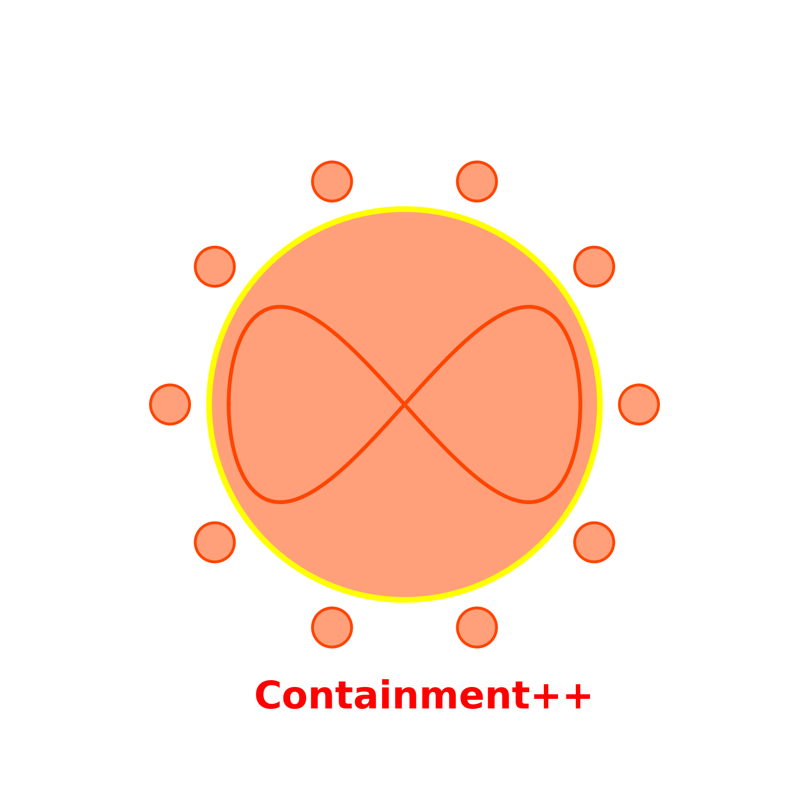

# **Containment++**

<div align="center">
    
</div>

**Containment++** is a modular C++ library for simulating the spread of infectious diseases using compartmental models such as **SIR** and **SEIR**. It offers flexibility in configuration, extensibility for adding new models, and user-friendly input methods (interactive, configuration file, and command-line flags).

---

## **Features**
- **Compartmental Models**:
  - **SIR (Susceptible-Infectious-Recovered)**.
  - **SEIR (Susceptible-Exposed-Infectious-Recovered)** with an incubation period.
- **Numerical Solver**:
  - Implements the **Runge-Kutta 4th order (RK4)** method for accurate integration.
- **Flexible Input Options**:
  - Interactive mode for real-time parameter entry.
  - JSON configuration file for predefined simulations.
  - Command-line flags for automation and scripting.
- **Output**:
  - Results saved in a CSV file for further analysis and visualization.
- **Extensible Design**:
  - Add new models or solvers with minimal changes to the core library.

---

## **Getting Started**

### **Directory Structure**
```plaintext
ContainmentPP/
├── include/
│   ├── Model.h                # Base class for compartmental models
│   ├── Solver.h               # Numerical solver base and RK4 implementation
│   ├── SimulationEngine.h     # Engine for running simulations
│   ├── json.hpp               # nlohmann/json library for JSON parsing
├── src/
│   ├── Solver.cpp             # RK4 solver implementation
│   ├── SimulationEngine.cpp   # Simulation engine implementation
├── models/
│   ├── SIRModel.h             # SIR model implementation
│   ├── SIRModel.cpp
│   ├── SEIRModel.h            # SEIR model implementation
│   ├── SEIRModel.cpp
├── examples/
│   ├── Main.cpp               # Example usage and input handling
├── LICENSE                    # MIT License for the project
├── .gitignore                 # Git ignore file to exclude unnecessary files
├── CMakeLists.txt             # Build system configuration
└── README.md                  # Project documentation
```

---

## **Prerequisites**
1. **C++ Compiler**:
   - A C++17-compliant compiler (e.g., GCC 9.0+, Clang 9.0+).
2. **CMake**:
   - Version 3.10 or higher.
3. **nlohmann/json**:
   - JSON library for configuration parsing (included in `include/json.hpp`).

---

## **Installation**

### **Step 1: Clone the Repository**
```bash
git clone https://github.com/SAURABH-RAI1729/ContainmentPP.git
cd ContainmentPP
```

### **Step 2: Build the Project**
1. Create a `build/` directory:
   ```bash
   mkdir build
   cd build
   ```
2. Run CMake to configure the project:
   ```bash
   cmake ..
   ```
3. Build the library and example program:
   ```bash
   cmake --build .
   ```

### **Step 3: Verify the Build**
Check the `build/bin/` directory for the executable:
```bash
ls bin/
# Output: example
```

---

## **Usage**

### **Run the Example Program**
The program supports three input methods:

#### **1. Interactive Mode**
If no arguments or configuration file is provided, the program prompts for input interactively:
```bash
./bin/example
```

#### **2. Configuration File**
Use a JSON file to define parameters and run the program:
```bash
./bin/example --config config.json
```

**Example `config.json`**:
```json
{
    "model": "SEIR",
    "beta": 0.3,
    "gamma": 0.1,
    "sigma": 0.2,
    "S0": 0.99,
    "I0": 0.01,
    "R0": 0.0,
    "dt": 0.01,
    "steps": 100
}
```

#### **3. Command-Line Flags**
Pass parameters directly via command-line arguments:
```bash
./bin/example --model SIR --beta 0.4 --gamma 0.2 --S0 0.95 --I0 0.05 --R0 0.0 --dt 0.01 --steps 200
```

### **Output**
Simulation results are saved in a CSV file (`simulation_results.csv`) in the current working directory:
```plaintext
Step,S,E,I,R
0,0.99,0.0,0.01,0.0
1,0.987,0.0,0.012,0.001
2,0.985,0.0,0.014,0.002
...
```

---

## **Extending the Library**

### **Add New Models**
1. Create a new header and implementation file in the `models/` directory.
2. Derive the new model class from the `Model` base class.
3. Define the model's equations and integrate with the solver.

### **Add New Solvers**
1. Create a new solver class in the `src/` directory.
2. Derive the class from the `Solver` base class.
3. Implement the `solve` method for the new solver.

---

## **Visualizing Results**
You can visualize the CSV output using Python.

**Example Python Script for Plotting**:
```python
import pandas as pd
import matplotlib.pyplot as plt

# Load the simulation results
data = pd.read_csv("simulation_results.csv")

# Plot the results
plt.plot(data["Step"], data["S"], label="Susceptible")
plt.plot(data["Step"], data["I"], label="Infected")
plt.plot(data["Step"], data["R"], label="Recovered")
plt.xlabel("Time Step")
plt.ylabel("Population Fraction")
plt.title("SIR Model Simulation")
plt.legend()
plt.show()
```

---

## **Contributing**
Contributions are welcome! This is a work in progress and more features will be added in near future. 
If you'd like to add new features or report issues, please:
1. Fork the repository.
2. Create a feature branch.
3. Submit a pull request with a detailed description.

---

## **License**
This project is licensed under the MIT License. See the [LICENSE](LICENSE) file for details.

---

## **Acknowledgments**
- **nlohmann/json** for JSON parsing.
- Inspired by compartmental models used in epidemiology.
